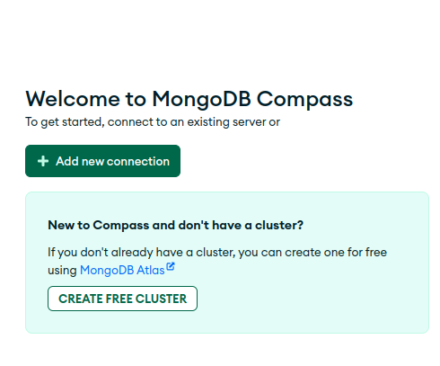
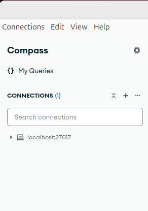
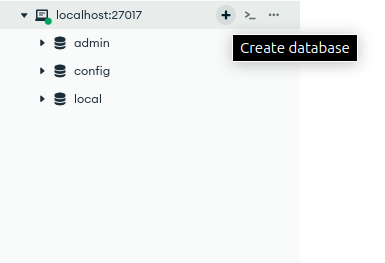
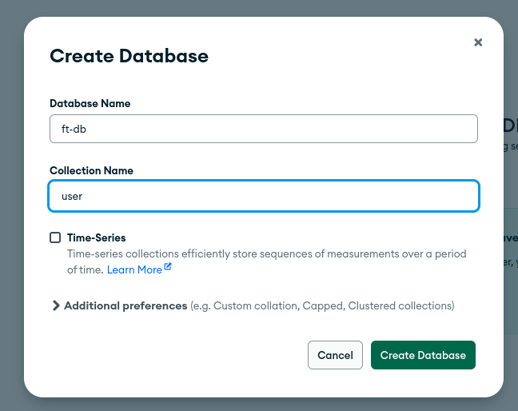
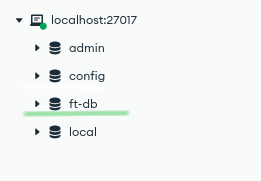

# Creating Database on MongoDB compass and Peforming queries through mongosh
> In this document we are exploring how we can create database and collections , and how can we perfrom queries in them using MongoDb Compass and Mongosh(MongoDb Shell). For this we are taking finance tracker as an example for which we will be creating a database and five collections within them.

# Tools Used
1. MongoDb Compass
2. mongosh (MongoDb Shell)

# Steps to follow
## 1. Creating Connection / Using exisiting Connection 
> Firstly, install the mogngoDb and mongo compass based on your system [MongoDb Installation Documentation](https://www.mongodb.com/docs/manual/administration/install-community/) & [MongoDb Compass Installation Documentation](https://www.mongodb.com/docs/compass/current/install/). 

> After this launch mogodb compass, you can see Add new connection 

> OR, select the existing connection you have created one to start connection

## 2. Creating a Database in Connection
> To create a database click (+) icon on existing connection

> Fill the database information with one collection and click create

> Database has been created successfully 

