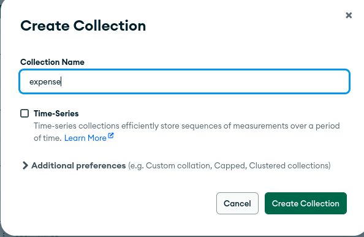

# Creating Database on MongoDB compass and Peforming queries through mongosh
> In this document we are exploring how we can create database and collections , and how can we perfrom queries in them using MongoDb Compass and Mongosh(MongoDb Shell). For this we are taking finance tracker as an example for which we will be creating a database and five collections within them.

# Tools Used
1. MongoDb Compass
2. mongosh (MongoDb Shell)

# Prerequisite
Install the mogngoDb and mongo compass based on your system [MongoDb Installation Documentation](https://www.mongodb.com/docs/manual/administration/install-community/) & [MongoDb Compass Installation Documentation](https://www.mongodb.com/docs/compass/current/install/). 

# Steps to create database with collections using mongo compass
## 1. Creating Connection / Using exisiting Connection 
> Firstly, launch mogodb compass, you can see Add new connection 

> OR, select the existing connection you have created one to start connection

## 2. Creating a Database in Connection
> To create a database click (+) icon on existing connection

> Fill the database information with one collection and click create

> Database has been created successfully 

## 3. Adding collection to Database and inserting data
> To add collection just on right side of the database, click on add icon.

> After that form appears asking the collecton name, in our case it's expense and click on create collection after filling the info

> Now lets add some data to the collection named expense for that select collection and click on add data, this gives you two option either insert document or just inport json file. Here we will be inserting document

> Add json data to the document, here we are inserting expense data and click insert.

# Database information
> This database is solely created with the purpose of storing data related to finance for users using the finance tracker app, here we have five collections or tables which are user, income, expense, portfolio and subscription.

# Collections or Table informations:

## 1. User Table
> This collection stores the information about user and consists unique id, email and name.

## 2. Income Table
> This collection stores the information about incomming transactions of user and consists unique id, email, descriptions and amount.

## 3. Expense Table
> This collection stores the information about outgoing transactions of user and consists unique id, email, category, descriptions and amount.

## 4. Portfolio Table
> This collection stores the information about portfoli of user like real state, share and other, and consists unique id, email, category, and amount.

## 5. Subscription Table
> This collection stores the information about user subscription to the finance tracker app, and consists unique id, email, type, and validity.

# Querying table using 'mongosh'
> After running the mongodb server, you can head to the terminal and type `mongosh` and hit enter to run

> Then type `use <db_name>` in our case it is `use ft-db`

> ### **10 queries for User table :**
1. select all users from user table
`db.user.find()`

2. select one specific user from user table
`db.user.findOne({email: "test3@test.com"})`

3. select user with name
`db.user.find({name: "User One"})`

